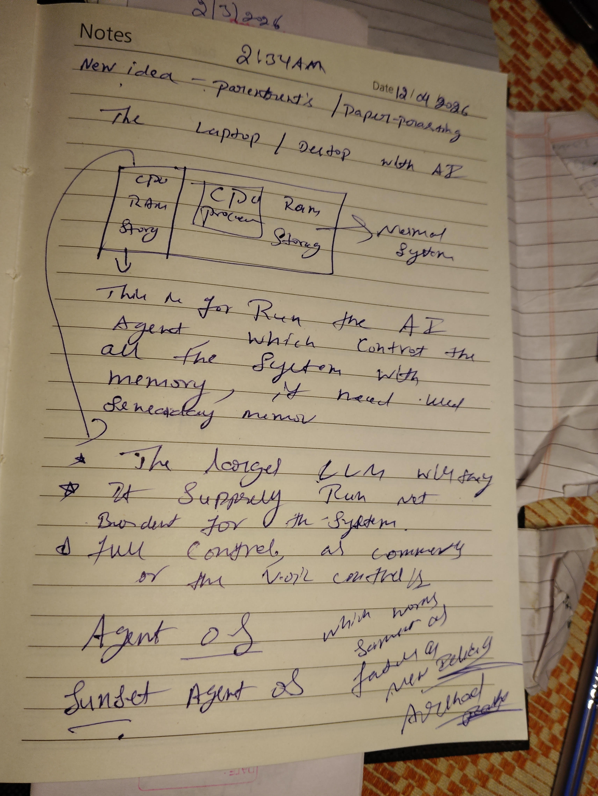
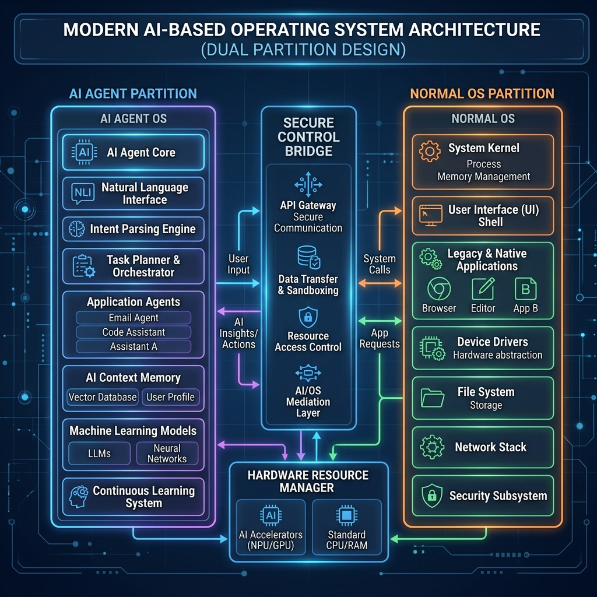
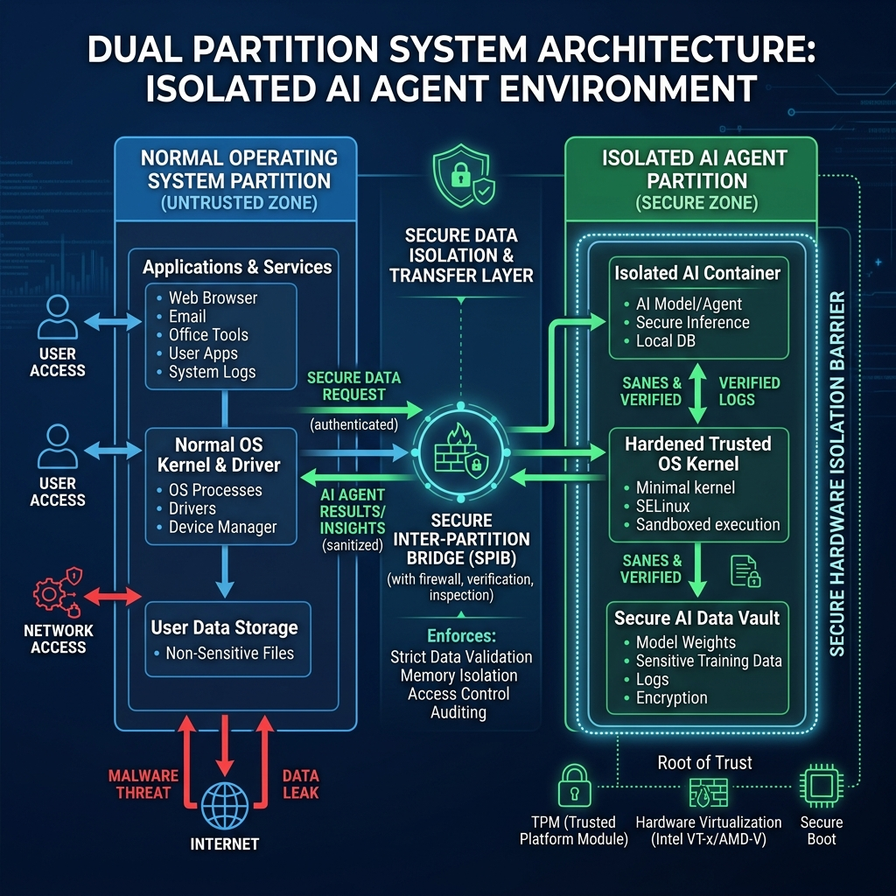
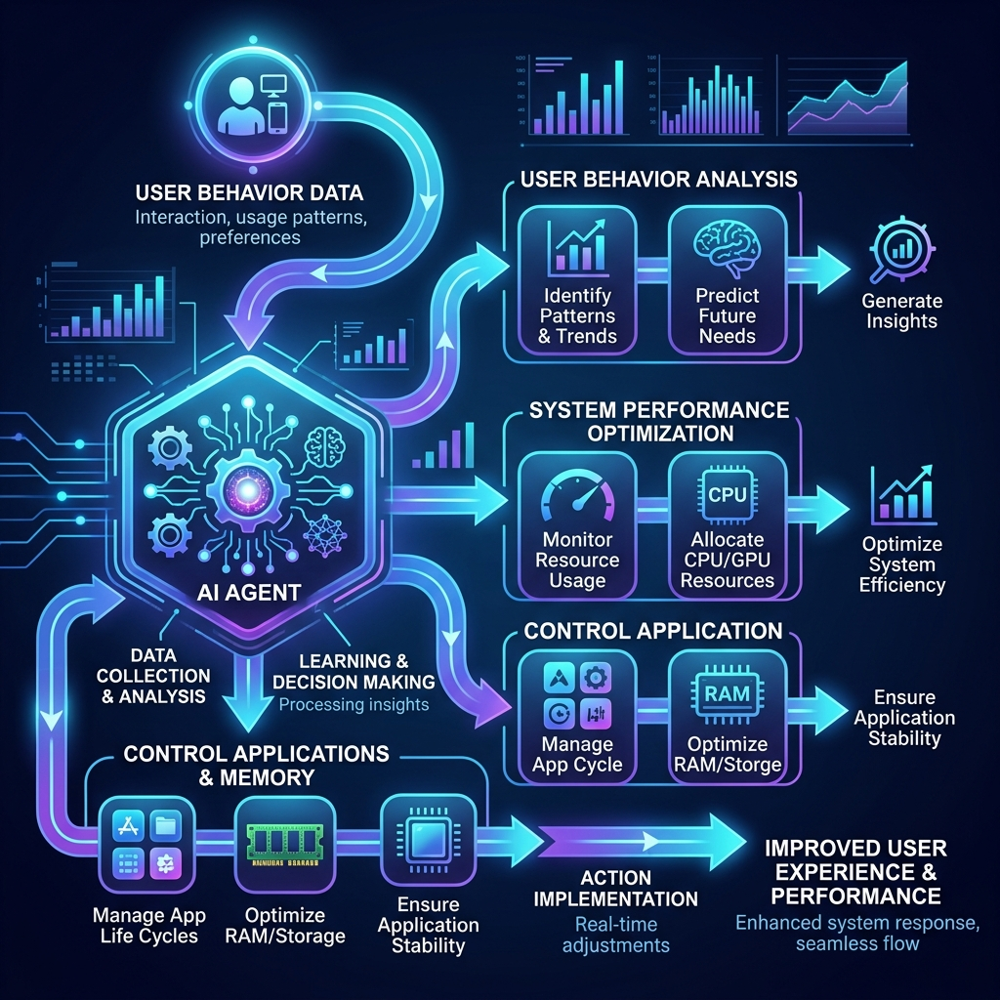
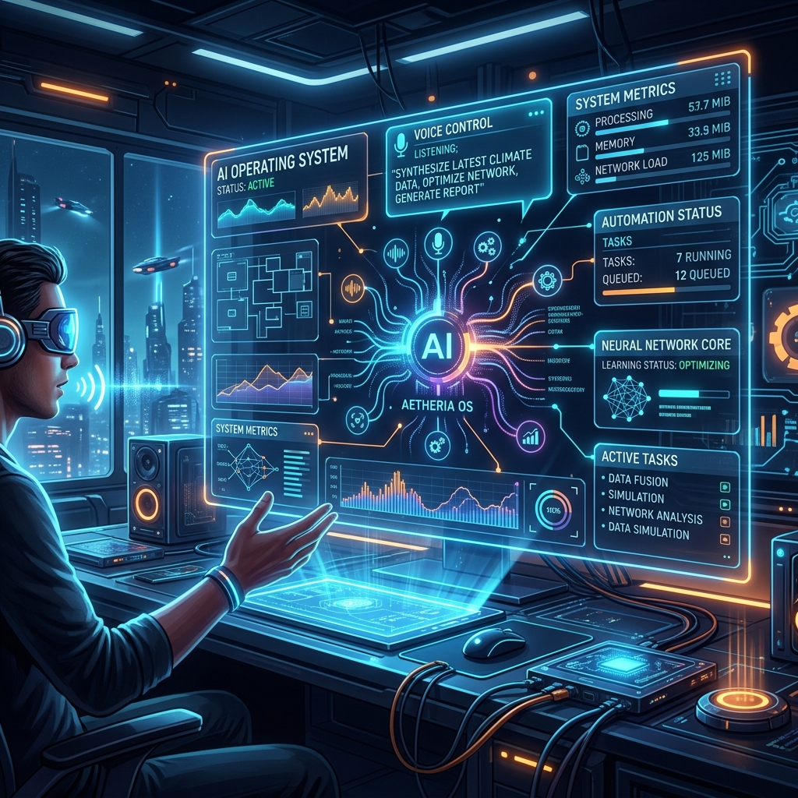

# 🌇 Sunset Agent OS

## 🚀 Overview
**Sunset Agent OS** is a paradigm-shifting, AI-driven operating system architecture. Rather than relying on traditional, rigid OS scheduling routines that require human intervention to balance memory and close applications, this system integrates an intelligent Artificial Intelligence (AI) Agent at its core.

The overriding goal of Sunset Agent OS is to build an environment where the Operating System acts as a **proactive intelligence** rather than a passive tool, intelligently and autonomously managing memory boundaries, CPU cycles, and active tasks.

---

## 📸 Original Sketches & Ideation
Below is the original founding sketch that serves as the blueprint for the Sunset Agent OS architecture:

The idea centers on treating the computer (Laptop/Desktop) as a two-part entity. The traditional processing (CPU/RAM/Storage) is segregated, granting the AI Agent absolute ownership over a dedicated piece of the system so it can run securely and efficiently without being constrained by normal processes.

---

## 🧠 Core Concept: The Dual-Partition Architecture
Traditional operating systems act as the standard middleman between the hardware and the user. The Sunset Agent OS redefines this model by implementing a **Dual Partition System**:

### 1. Normal OS Partition (User Environment)
This partition feels entirely unchanged to the end-user. It houses standard applications (browsers, IDEs, games) and standard file storage, running a familiar environment much like modern Windows or Linux distributions.

### 2. AI Agent Partition (Intelligent Controller)
This is an isolated, dedicated partition controlled exclusively by the AI. Because it holds its own domain, it cannot be arbitrarily terminated, starved of memory, or exposed to user-side vulnerabilities. 
*   **Behavior Understanding:** The AI continuously learns user patterns from the other partition. 
*   **Automated Analytics:** It analyzes data locally (preventing privacy leaks since data is not forced onto cloud servers).

### 3. The Control Bridge (Secure API)
A heavily monitored set of APIs connecting the Normal Partition to the AI Partition. This prevents unauthorized system access, meaning standard applications cannot hijack the AI’s administrative privileges, guaranteeing high-grade cybersecurity.

---

## ⚙️ How It Works in Practice

### Intelligent Memory & Resource Allocation
Instead of generic swap-files or rigid cache rules, the AI Agent dynamically allocates RAM. 
*   If a specific application (e.g., a heavy code compilation or specific game) requires immense memory, the agent intervenes, saving states and safely suspending background apps. 
*   "If needed, use memory dynamically" means the Agent understands context and priority, closing or throttling unnecessary processes instantly.

### Modular AI (LLM Switching)
A typical OS isn’t upgraded effortlessly, and Large Language Models (LLMs) update frequently. Sunset Agent OS embraces a **Modular Intelligence** approach. 
*   "The largest LLM will simply run and not burden the system." 
*   The AI "brain" can be heavily optimized for local inference, or users can inject third-party LLM frameworks entirely. The OS does not rely on *one* AI—the Agent structure is flexible, allowing you to swap out or "update the agent like an OS".

### Full Control and Hybrid Processing
*   **Company/Creator Control Layer:** Provides top-level control over exactly what boundaries the AI enforces, making it a viable enterprise choice.
*   **Local First Strategy:** Heavy processing can be offloaded, but crucial telemetry, indexing, and analysis are retained completely on-board within the AI partition, keeping end-user data strictly secure from outside access.

---

## 🏗️ Architectural Blueprints

*For system-level structural documentation, please evaluate our AI-generated architectural layouts:*

### 1. Modern System Architecture

### 2. Dual Partition Diagram Close-Up

### 3. Process Logic & Control Flow

### 4. Futuristic Control Implementation UI

---

## ⚠️ Intellectual Property Notice
**© 2026 Arshad Pasha. All rights reserved.**

The concepts, dual-partition framework, intelligent modular agent logic, initial architectural sketches, and related system ideas termed "Sunset Agent OS" are the exclusive intellectual property of the author. Unauthorized use, reproduction, or distribution is prohibited.

*Document updated 2026. Phase: Complete Ideation & Blueprint Structure.*
